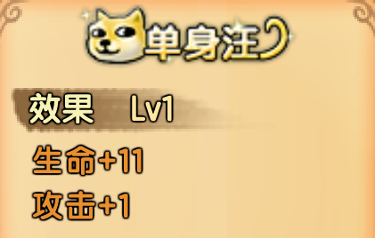
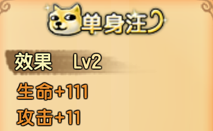
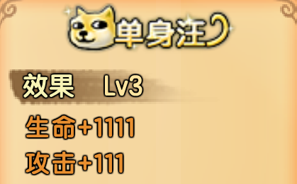
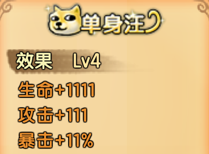
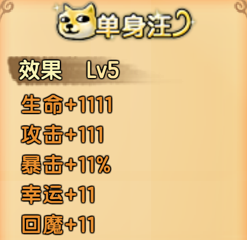
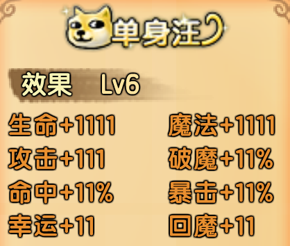
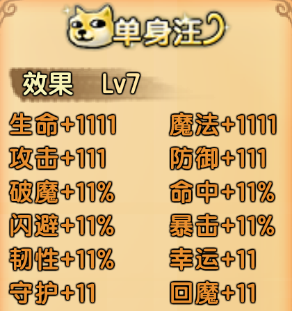
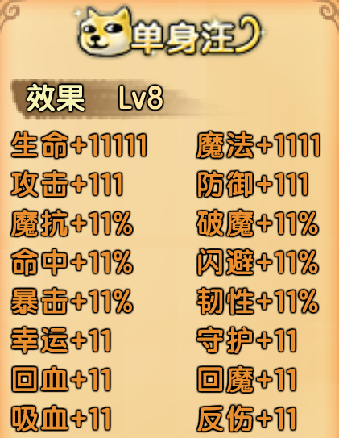
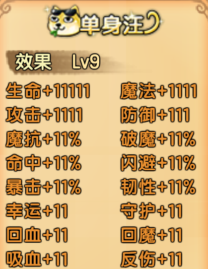

# 单身汪

## 价格表

| 等级 | 价格（点券） | 总计价格（点券） | 价格（元） | 总计价格（元） | 备注       |
| ---- | ------------ | ---------------- | ---------- | -------------- | ---------- |
| 一级 | 0            | 0                | 0          | 0              | 22000灵魂  |
| 二级 | 0            | 0                | 0          | 0              | 52011灵魂  |
| 三级 | 1111         | 1111             | 11.11      | 11.11          |            |
| 四级 | 2111         | 3222             | 21.11      | 32.22          |            |
| 五级 | 5111         | 8333             | 51.11      | 83.33          | 性价比高   |
| 六级 | 8111         | 16444            | 81.11      | 164.44         | 性价比最高 |
| 七级 | 11111        | 27555            | 111.11     | 275.55         |            |
| 八级 | 14111        | 41666            | 141.11     | 416.66         |            |
| 九级 | 17111        | 58777            | 171.11     | 587.77         | 冲战力     |

## 一级二级单身汪

虽然一二级狗加属性很低，但是礼包里面份别有1个中级幸运符和1个三级强化石，而且它免费，出必买！！！

## 三级单身汪

| 对比上一级提升的属性 | 生命+1000 | 攻击+100 |
| -------------------- | --------- | -------- |

三级狗给的属性不多，礼包里有3个高级幸运符。

性价比很低，不建议单买。

## 四级单身汪

| 对比上一级提升的属性 | 暴击+11% |
| -------------------- | -------- |

四级狗多了11暴击，礼包里有一个4级攻击石。

性价比还行，但是不建议买到四级，直接买到五级提升巨大。

## 五级单身汪

| 对比上一级提升的属性 | 幸运+11 | 回魔+11 |
| -------------------- | ------- | ------- |

五级狗11的暴击幸运回魔都是有用的属性，礼包里有一个5级幸运石。

共83.33性价比高，推荐购买。

## 六级单身汪

| 对比上一级提升的属性 | 魔法+1111 | 命中+11% | 破魔+11% |
| -------------------- | --------- | -------- | -------- |

六级狗给的魔法在缺蓝西游里很有用，命中在血海有用，11破魔对魔攻职业有用。

礼包里有一个5级暴击石。

共164.44性价比最高，推荐购买。

## 七级单身汪

| 对比上一级级提升属性 | 防御+111 | 闪避+11% | 韧性+11% | 守护+11 |
| -------------------- | -------- | -------- | -------- | ------- |

七级狗给的防御闪避韧性守护用处不大，礼包里有一个5级攻击石。

性价比很低，不推荐。

## 八级单身汪

| 对比上一级提升的属性 | 生命+10000 | 魔抗+11% | 回血+11 | 吸血+11 | 反伤+11 |
| -------------------- | ---------- | -------- | ------- | ------- | ------- |

八级狗给的10000生命能提高角色保命能力，礼包里有一个5级百变宝石袋。

性价比较低，不推荐。

## 九级单身汪

| 对比上一级提升的属性 | 攻击+1000 |
| -------------------- | --------- |

九级狗1000攻击，但是要多花很多钱，礼包里有一个5级百变宝石袋和一个4级百变宝石袋。

性价比低，不推荐，氪佬随意。