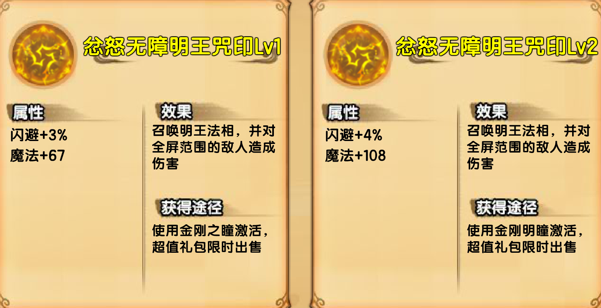
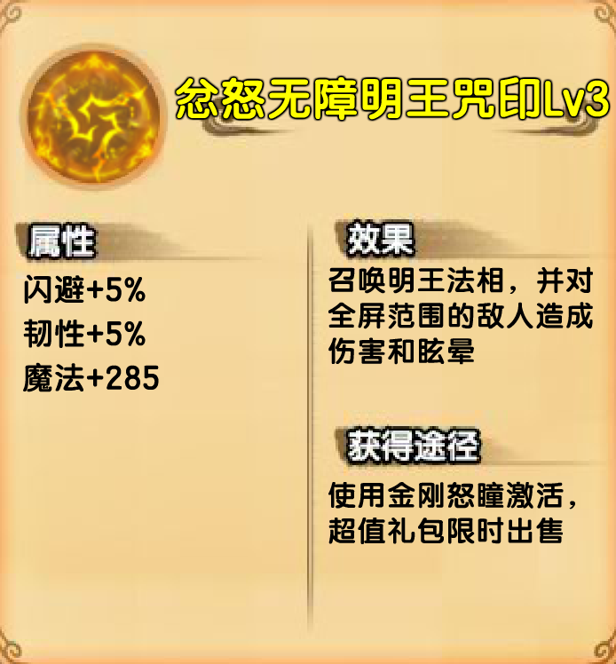
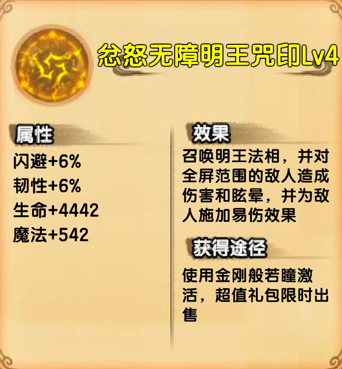
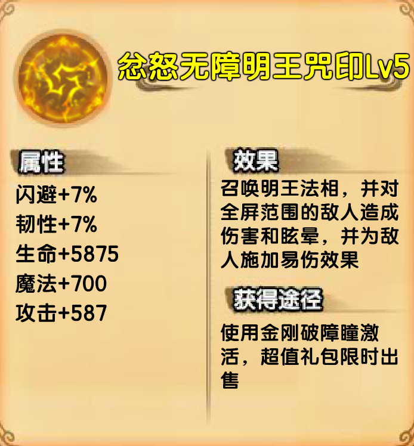
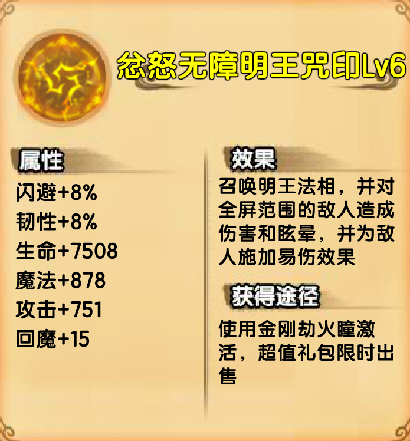

# 忿怒无障明王咒印

## 价格表

| 等级 | 价格（点券） | 总计价格（点券） | 价格（元） | 总计价格（元） | 备注      |
| ---- | ------------ | ---------------- | ---------- | -------------- | --------- |
| 一级 | 0            | 0                | 0          | 0              | 22000灵魂 |
| 二级 | 0            | 0                | 0          | 0              | 52011灵魂 |
| 三级 | 1300         | 1300             | 13         | 13             | 多了眩晕  |
| 四级 | 2300         | 3600             | 23         | 36             | 多了易伤  |
| 五级 | 5300         | 8900             | 53         | 89             |           |
| 六级 | 8300         | 17200            | 83         | 172            |           |

## 一级二级

## 三级

| 对比上一级提升的属性 | 闪避+1% | 韧性+5% | 魔法+285 |
| -------------------- | ------- | ------- | -------- |

## 四级

| 对比上一级提升的属性 | 闪避+1% | 韧性+1% | 生命+4442 | 魔法+257 |
| -------------------- | ------- | ------- | --------- | -------- |

## 五级

| 对比上一级提升的属性 | 闪避+1% | 韧性+1% | 生命+1433 | 魔法+45 | 攻击+587 |
| -------------------- | ------- | ------- | --------- | ------- | -------- |

## 六级

| 对比上一级提升的属性 | 闪避+1% | 韧性+1% | 生命+1633 | 魔法+178 | 攻击+164 | 回魔+15 |
| -------------------- | ------- | ------- | --------- | -------- | -------- | ------- |