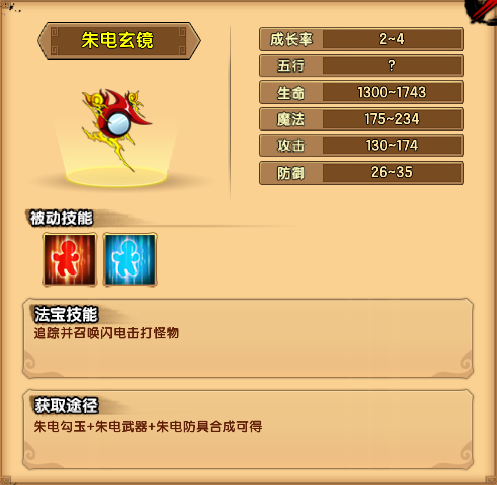

# 电

## 小怪掉落

| 木类材料 | 矿类材料 | 布类材料 |
| -------- | -------- | -------- |
| 玉莹草   | 七彩晶   | 星河纱   |

## 琉璃宫

| 九尾天狐技能                                                 |
| ------------------------------------------------------------ |
| 破魔珠璃：向玩家的方向射出手中的琉璃珠                       |
| 魅惑之吻：抛出魅惑之吻，飘向前方，魅惑玩家                   |
| 九珠琉璃：甩动九条尾巴，九颗小琉璃珠升至空中消失，然后在玩家上方落下 |
| 噬魂琉璃：召唤一个封印着鬼魂的琉璃珠，琉璃珠会来回弹动，当碰触到玩家会黏附在身上，吸取力量，可以被击破 |
| 九命狐狸：能够复活8次，每次复活一次新增一条尾巴，最终形态有九条尾巴，每次复活后生命和攻击会略微提升 |

掉落装备：朱电防具制作书

## 金玉宫

| 金翅大鹏雕技能                                               |
| ------------------------------------------------------------ |
| 金枪狂舞：舞动长枪，攻击周身的玩家                           |
| 炫目鹏风：震动双翅，扇出一个龙卷风向前方飞去，中招后有造成目眩效果（命中下降） |
| 食尽诸龙：俯冲并啄食玩家，攻击成功后可以恢复自己生命         |
| 化羽为剑：宛如宝剑般的翅膀在空中舞动，金色利刃的翎羽从四面八方射出 |
| 云程万里：大幅度提升飞行移动速度、闪避率、命中率。           |

掉落装备：朱电武器制作书（包括第二心法）

## 浮天台

| 电之祖巫技能                                                 |
| ------------------------------------------------------------ |
| 双蛇挥击：使用左手和右手（红蛇和青蛇），轮番攻击近身的玩家   |
| 球状闪电：左手和右手的蛇嘴向上张开，发射数个球状闪电从天缓缓而降 |
| 血阳闪电：左手红蛇张开，向玩家方向，射出一道红色闪电         |
| 阴冥闪电：右手青蛇张开，向玩家方向，射出一道蓝色闪电         |
| 雷霆万钧：召唤一排闪电，从左到右依次降落                     |

掉落装备：朱电勾玉制作书

## 法宝

| 被动 | 属性 |
| ---- | ---- |
| 回血 | 4~6  |
| 回魔 | 3~4  |