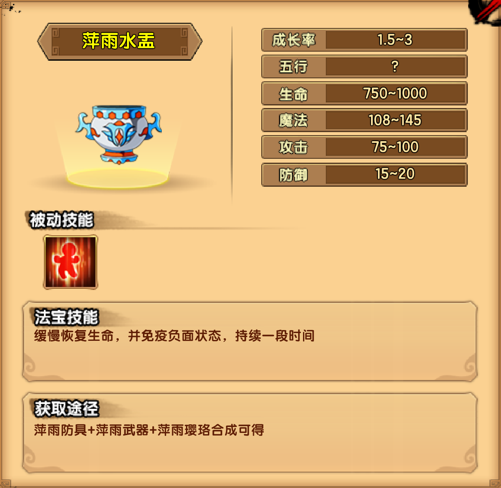

# 雨

## 小怪掉落

| 木类材料 | 矿类材料 | 布类材料 |
| -------- | -------- | -------- |
| 落青藤   | 雾水岩   | 素纤麻   |

## 花果山

| 通臂白猿技能                                     |
| ------------------------------------------------ |
| 通臂飞拳：向前猛击数拳，每拳均伴有透明的拳影打出 |
| 手拿日月：召唤一只透明的巨手，将玩家抓住         |
| 崩山直拳：蓄力后，极速冲至玩家面前，打出一记直拳 |
| 逆击乾坤：迅速回身打出一记上勾拳将玩家击飞       |

掉落装备：萍雨防具制作书

## 水帘洞

| 六耳猕猴技能                                                 |
| ------------------------------------------------------------ |
| 猕猴棍法：挥舞棍棒攻击前方玩家                               |
| 烈焰闪：快速向前冲去，对经过的目标造成伤害                   |
| 烈焰风暴：快速旋转震开周围目标并造成多次伤害                 |
| 嗜血火眼：释放后攻击提升并附带吸血效果                       |
| 火魔斩：冲向空中释放火魔九连斩，落地后为最后一斩，造成极高伤害 |

掉落装备：萍雨武器制作书

## 桃花谷

| 雨之祖巫技能                                                 |
| ------------------------------------------------------------ |
| 毁灭撕裂：挥舞巨爪攻击前方及附近的玩家                       |
| 暴雨骨针：张开血盆大口，细小的骨针如暴雨般射出               |
| 骨刺扫射：连续射出背上的骨刺，攻击前方的玩家                 |
| 玄冥之雨：空中降下玄冥之雨，使玩家生命力缓慢流失，BOSS生命力缓慢恢复 |
| 雾气流动：BOSS受到一定伤害后会化作一团雾气消失，并出现在屏幕的另一端 |
| 骨刺守护：被动技，玄冥除了头部，全身均覆盖骨刺，攻击其骨刺会受到反伤 |

掉落装备：萍雨璎珞制作书

## 法宝

| 被动 | 属性 |
| ---- | ---- |
| 回血 | 3~4  |