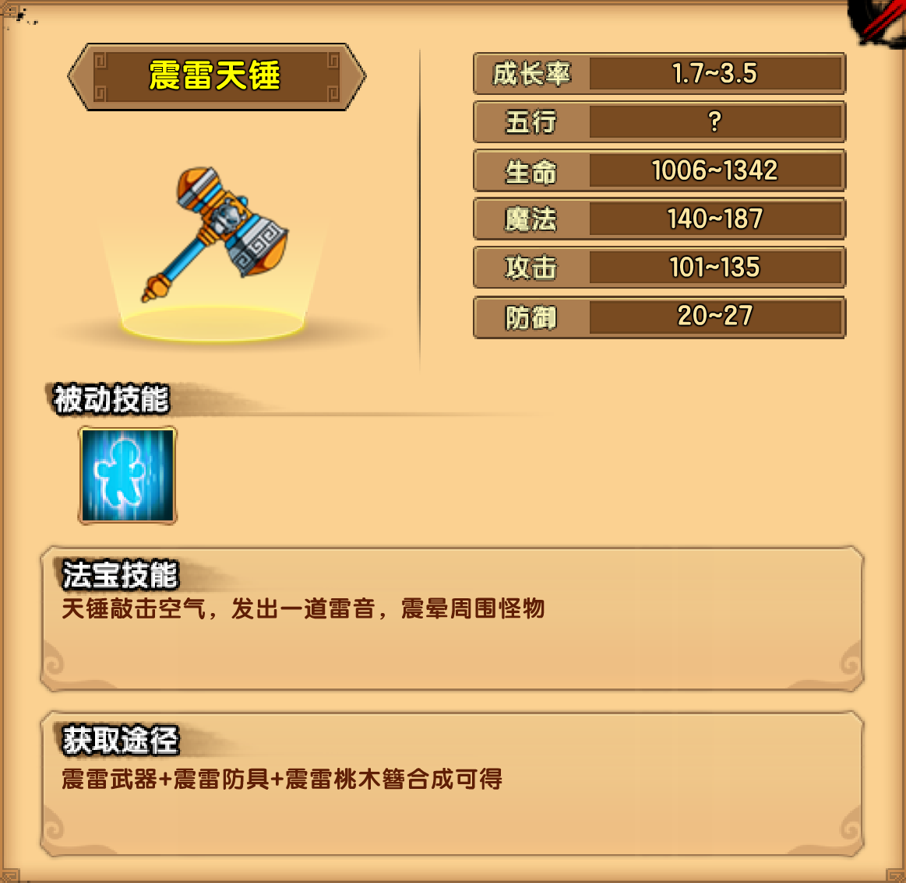

# 雷

## 小怪掉落

| 木类材料 | 矿类材料 | 布类材料 |
| -------- | -------- | -------- |
| 绿针藓   | 朱砂石   | 墨谷棉   |

## 蝙蝠窟

| 千年蝠妖技能                                                 |
| ------------------------------------------------------------ |
| 狂翼蝠爪：使用蝙蝠爪攻击前方的玩家                           |
| 死亡声波：张开嘴巴，向前方发出死亡声波，伤害并晕眩范围内的玩家 |
| 汲血灵蝠：释放一只灵魂状态的蝙蝠向玩家的方向飞去，灵魂蝙蝠碰触到玩家时会为蝠妖汲取生命 |
| 蝙蝠石像：化身为蝙蝠石像，落回地面，并缓慢恢复生命，同时释放出四只精英蝙蝠，过了15秒后，BOSS恢复原状 |

掉落装备：震雷防具制作书

## 七星洞

| 黄眉大王技能                                                 |
| ------------------------------------------------------------ |
| 敲磬槌击：边前进边挥舞敲磬槌攻击前方的玩家                   |
| 召唤魔袋：张开口袋，将前方的玩家吸到跟前；口袋口长出牙齿，咬附在玩家背上，缓慢汲取玩家的生命、魔法。 |
| 召唤金铙：像风火轮一样沿着地面快速滚动，夹住玩家的双脚，使玩家无法移动和跳跃；消失后，出现在玩家正上方，变大后砸下，接触到地面时，发出沿地声波 |

掉落装备：震雷武器制作书

## 万妖穴

| 雷之祖巫技能                                                 |
| ------------------------------------------------------------ |
| 撕天巨力：挥舞巨爪攻击前方及附近的玩家                       |
| 震天长啸：张开血盆大口，朝天空发出一阵长啸，将洞窟顶部的岩石震落 |
| 震地重击：用手重重锤击地面，地面震动，伤害站在地面的玩家     |
| 回声怒吼：往玩家所在方向发出回旋音波，碰触到墙壁、地面后会反弹 |
| 蛇影追击：尾巴化为蛇影，往玩家所在方向射出，命中后缠绕       |

掉落装备：震雷桃木簪制作书

## 法宝

| 被动 | 属性 |
| ---- | ---- |
| 回血 | 3~4  |