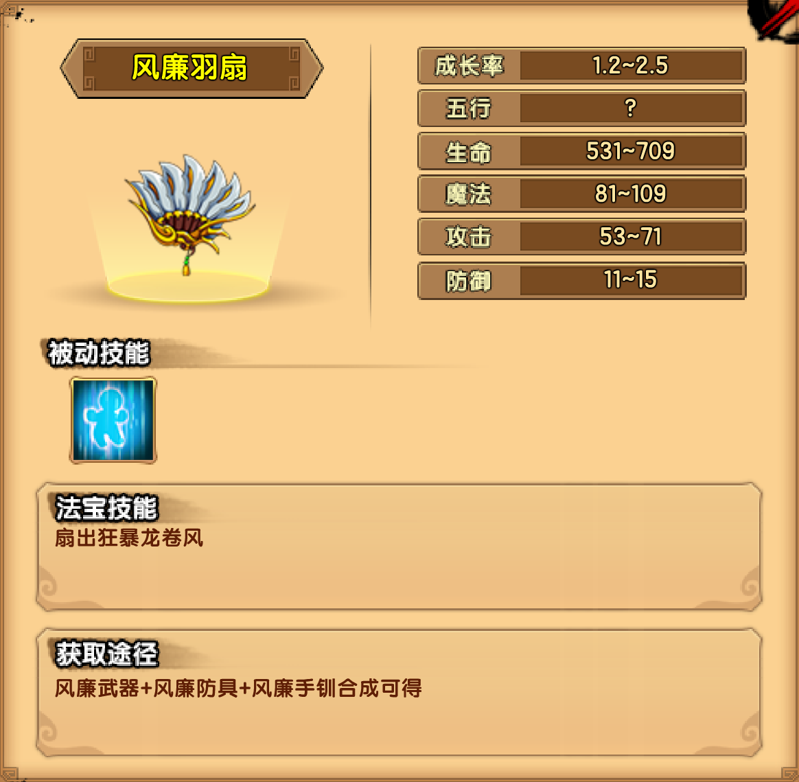

# 风

## 小怪掉落

| 木类材料 | 矿类材料 | 布类材料 |
| -------- | -------- | -------- |
| 棕椰木   | 黄磷沙   | 金蚕丝   |

## 金沙村

| 黄风大王技能                                                 |
| ------------------------------------------------------------ |
| 三昧神风：在前方刮起一阵巨大的龙卷风，缓缓向前移动一段距离后消失 |
| 飞沙走石：挥舞钢叉，击飞脚下的石块飞向前方攻击玩家           |
| 足下生风：BOSS化为一道龙卷后消失，然后出现在屏幕的另一侧     |

掉落装备：风廉防具制作书

## 百仙园

| 百仙虫技能                                                   |
| ------------------------------------------------------------ |
| 巨虫之咬：用牙齿啃咬玩家                                     |
| 魔虫吐丝：吐出一团丝线，碰触到的玩家将被丝茧包裹，无法攻击和移动 |
| 化虫成茧：战斗时间40秒后，变身成茧形态并恢复25%的生命值      |

| 百仙蛹技能                                                   |
| ------------------------------------------------------------ |
| 丝茧之扰:虫茧伸出丝线攻击周身的玩家，使玩家被丝线纠缠，攻击力下降 |
| 化茧成蛾：战斗时间40秒后，变身成蛾形态并恢复25%的生命值      |

| 百仙蝶技能                                                   |
| ------------------------------------------------------------ |
| 衰竭之粉：双翅一展，散发出数团鳞粉飘向玩家，使玩家中毒并无法恢复生命 |
| 剧毒之风：吹出一阵剧毒之风向前飘去，被刮中玩家会中毒并持续扣血 |
| 鳞翅之展：展开鳞翅，弹飞周身的玩家，并附带毒伤               |

掉落装备：风廉武器制作书

## 傲来国

| 风之祖巫技能                                                 |
| ------------------------------------------------------------ |
| 中央上方的真面处于沉睡状态，每次随机唤醒两个假面发动攻击。假面有独立的生命，可以被破坏。 |
| 当所有假面都被破坏时BOSS进入第二形态。                       |
| 进入第二形态后所有假面复活并且中央的真面被唤醒。             |
| 击败真面后可以获得胜利。                                     |

掉落装备：风廉手钏制作书

## 法宝

| 被动 | 属性 |
| ---- | ---- |
| 回魔 | 1~2  |
