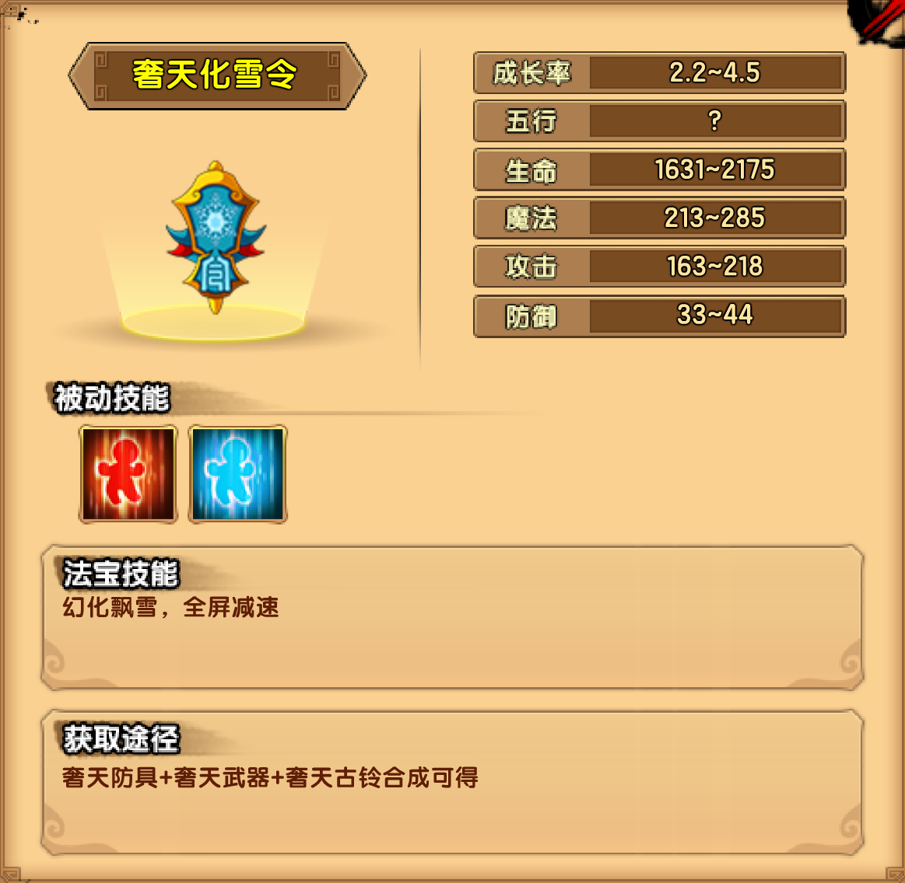

# 天气

## 小怪掉落

| 木类材料 | 矿类材料 | 布类材料 |
| -------- | -------- | -------- |
| 雪莲花   | 绿磷矿   | 冰凝缎   |

## 苍梧渊

| 青霄玉女技能                                               |
| ---------------------------------------------------------- |
| 霜雪之舞：舞动长袖，对周身的玩家造成伤害                   |
| 寒霜之音：拨动琴弦，一股霜风随着琴音飘出，有冰冻效果       |
| 封霜飘雪：雪花随着颤动的琴弦飘然而下，洒在大地上，霜冻雪封 |
| 冰霜之镜：召唤冰霜之镜，反射伤害                           |
| 冰雪之影：召唤冰雪之影，释放霜雪之舞                       |

掉落装备：奢天防具制作书

## 寒山坡

| 辟暑大王技能                                                 |
| ------------------------------------------------------------ |
| 犀角冲撞：猛地向前冲撞很长一段距离。                         |
| 大刀挥砍；挥舞大刀攻击近身的玩家。                           |
| 烈日当空；从空中召唤一道烈日，持续数秒，玩家若进入烈日照耀的区域会持续降低生命和魔法 |

| 辟寒大王技能                                       |
| -------------------------------------------------- |
| 犀角冲撞：猛地向前冲撞很长一段距离                 |
| 腾空飞斧；抛掷斧头攻击远处的玩家,之后收回          |
| 寒风瑟瑟；召唤一股寒风刮过，被刮到的玩家会行动迟缓 |

掉落装备：奢天武器制作书（第一心法）

| 辟尘大王技能                                                 |
| ------------------------------------------------------------ |
| 犀角冲撞：猛地向前冲撞很长一段距离                           |
| 奇挞藤击：变长奇挞藤，捅击前方的玩家                         |
| 烟尘弥漫：召唤一团遮挡视线的烟尘，持续一段时间（附加效果，使玩家命中和闪避下降） |

掉落装备：奢天武器制作书（第二心法）

## 冻天

| 天气电之祖巫技能                                             |
| ------------------------------------------------------------ |
| 利爪连舞：挥舞前爪连续攻击前方的玩家                         |
| 春回雾暖：召唤一团雾气，雾气可以被打散，玩家站在雾气里命中会下降，BOSS站在雾气里会持续回血 |
| 冬雪严寒：耳朵上的青蛇幻化出一个雪蛇图腾，雪蛇会召唤大雪，若10秒内不被破坏，将冻结全场玩家 |
| 夏阳酷暑：另一只耳朵上的青蛇幻化出一个烈蛇图腾，烈蛇发出烈日的光芒，被光芒笼罩的玩家生命回复、法力回复将下降 |
| 秋风为虐：从远端刮过一阵旱风，吸入BOSS口中，被刮到的玩家生命和法力上限将会下降 |

掉落装备：奢天古铃制作书

## 法宝

| 被动 | 属性 |
| ---- | ---- |
| 回血 | 6~8  |
| 回魔 | 3~5  |