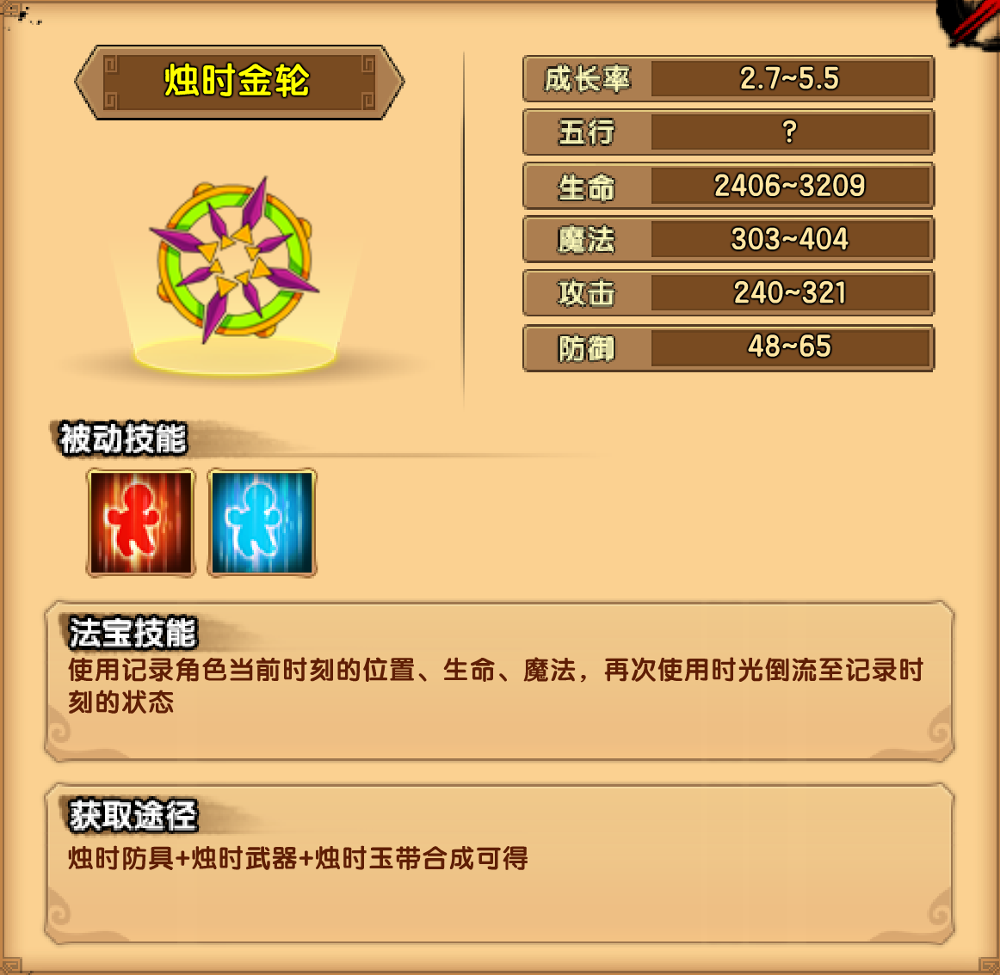

# 时间

## 小怪掉落

| 木类材料 | 矿类材料 | 布类材料 |
| -------- | -------- | -------- |
| 葫芦藓   | 碎陨星   | 流光绸   |

## 夙夜径

| 角木蛟技能                                                   |
| ------------------------------------------------------------ |
| 蛟龙突击：伸长长枪向玩家方向突刺                             |
| 木蛟之影：将枪刺入地面，地面长出木藤呈龙形向前移动，碰触到玩家后将其束缚 |
| 棘刺之木：在地面随机一处召唤一株卷曲的长刺灌木，攻击灌木会受到伤害 |
| 灭世双蛟：从脚下出现两只木龙盘旋缠绕升起，飞出屏幕顶端，之后从玩家头顶上方落下 |
| 蛟临天下：脚下生成一株小树，BOSS跃至树上；BOSS在树上时处于霸体状态，并持续恢复生命，且会不断向玩家投掷长枪；树可以被破坏，树破坏后BOSS将落回地面解除状态 |

掉落装备：烛时防具制作书

## 太虚星河

| 应龙·鼓技能                                                  |
| ------------------------------------------------------------ |
| 灭神龙爪：手化为巨大龙，攻击周身玩家                         |
| 星流之翼：煽动双翼，向玩家方法射出2道交叉缠绕的流星          |
| 噬星龙爪：手化为巨大龙爪，急速飞向玩家后将其擒住，缓慢抽取魔法；此时玩家无法移动、跳跃、使用技能，玩家需通过对BOSS造成一定伤害，解除该状态 |
| 毁灭星核：在一定范围内召唤3颗星核，星核会在5秒后化为流星射向玩家 |
| 斗转星移：用双翼和星辰包裹身体，此时所受的任何伤害都将被吸收并转化为生命回复 |

掉落装备：烛时武器制作书（第一心法）

| 女魃技能                                                     |
| ------------------------------------------------------------ |
| 旱魃为虐：持续施法，链接周身的目标持续抽取生命，目标离开区域或5秒后方可解除。 |
| 众生聚灭：持续施法，出现蓝色流火吸向女魃，玩家碰触流火后会被带往BOSS处 |
| 焚天流火：高举法杖，向四面八方发射数道红色流火               |
| 噬魔火灵：从法杖中召唤1个蓝色火灵。每当玩家使用技能，蓝灵会吸取玩家10%的魔法 |
| 噬血火灵：从法杖中召唤1个红色火灵。每当玩家受到伤害，红灵会吸取玩家10%的生命 |

掉落装备：烛时武器制作书（第二心法）

## 钟晷极地

| 时间祖巫技能                                                 |
| ------------------------------------------------------------ |
| 拍击：用爪子拍打地面，攻击近身的玩家                         |
| 摆尾：摆动尾巴，攻击周身的玩家                               |
| 嘘为风影：深吸一口气，从屏幕边缘出现数道龙影，如同疾风一般冲向玩家 |
| 吹为雷火：深吐一口气，一道火柱从口中喷发而出，横扫地面       |
| 逆时之烛-年轻：召唤逆时之烛，使时光逆转，持续恢复烛龙的生命（烛火每秒减少5%的生命，当烛火燃尽时效果消失。攻击烛火可以加快烛火的燃烧速度） |
| 静时之烛：召唤静时之烛，当烛火燃尽时，将会冻结玩家的时间数秒（烛火每秒减少2.5%的生命，当烛火燃尽时效果消失。攻击烛火可以加快烛火的燃烧速度） |
| 幽阴之眼：闭上眼睛，全屏变成黑夜，伸手不见五指（在黑暗的区域，玩家的命中大幅下降） |
| 顺时之烛-衰老：顺时之烛受到一定的攻击后，烛火将会点亮，黑暗将被照亮，但玩家生命也会随着烛火缓缓流逝。（烛火每秒减少2.5%的生命，当烛火燃尽时效果消失，但数秒后会重新出现。攻击烛火可以加快烛火的燃烧速度） |

掉落装备：朱电勾玉制作书

## 法宝

| 被动 | 属性 |
| ---- | ---- |
| 回血 | 8~11 |
| 回魔 | 5~7  |