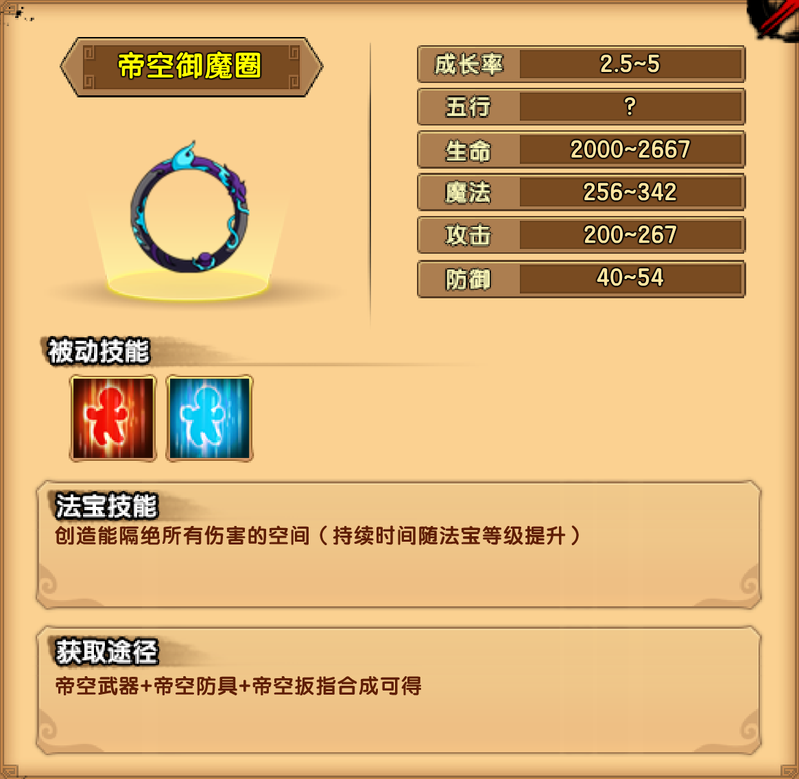

# 空间

## 小怪掉落

| 木类材料 | 矿类材料 | 布类材料 |
| -------- | -------- | -------- |
| 缠星藻   | 青铜石   | 镜魂丝   |

## 蜃楼城

| 独角兕大王技能                                               |
| ------------------------------------------------------------ |
| 霸枪连刺：举起丈二长的钢枪横扫周身后，向前方连刺三下。       |
| 诸牛听令：长枪往地上一立，召唤两头青牛，从两侧狂奔而出。     |
| 金钢琢：召唤金钢琢参与战斗                                   |
| 金刚琢撞击玩家，玩家被撞后将有短暂晕眩                       |
| 金刚琢略微变大套向玩家，玩家被套住后，被金刚琢夺取全部装备（外观消失并且属性降低），打破金刚琢或一分钟后状态解除 |
| 金刚琢变大后出现在玩家上方，释放兵器雨砸向玩家               |

掉落装备：帝空防具制作书

## 幻境阁

| 百眼魔君技能                                                 |
| ------------------------------------------------------------ |
| 双剑连舞：边快速前进，边挥舞手中的双剑连续攻击前方的玩家     |
| 百眼金光：露出胸口的眼睛向前射出金光（细长型的子弹特效），中招后将被禁锢 |
| 千眼金光：双臂齐抬，正过身来，胸口的眼睛向多个方向射出金光，中招后将被禁锢 |
| 妖幻之镜：在屏幕最左侧和最右侧各召唤一面镜子，该镜子会反射BOSS的千眼金光 |
| 幻惑毒烟：释放黄色的毒烟迷惑玩家的心智。毒烟会在场上持续一段时间，被毒烟笼罩时将无法使用技能，并持续受到伤害 |

掉落装备：帝空武器制作书（第一心法）

| 盘丝大仙技能                                                 |
| ------------------------------------------------------------ |
| 短剑连击：使用手中的剑连续攻击前方的玩家                     |
| 玄丝乱舞：拉丝飞出屏幕顶部，并从玩家正上方拉丝落下，对玩家进行多段攻击 |
| 束缚之丝：往玩家方向发射蛛丝，将玩家包裹，被射中后将无法行动 |
| 藏身入镜：牵丝飞至自己的镜子，渐隐，藏身到镜子中一段时间     |

掉落装备：帝空武器制作书（第二心法）

## 壶中洞天

| 空间祖巫技能                                                 |
| ------------------------------------------------------------ |
| 混沌漩涡：从手中生成红白的螺旋球，射向玩家                   |
| 虚无空间：在玩家所在位置召唤一个黑球，慢慢变大变成黑洞，若玩家没有在黑洞最终形成时逃离，将会被吸入虚无空间（在虚无空间中有4个追魂使者，玩家将其消灭才可离开，虚无空间中玩家无法回血回魔、使用坐骑） |
| 虚空死魂：召唤一个传送门，传送门每隔10秒会召唤一追魂使者，传送门可被破坏 |
| 虚空暗影：在地面出现一个连接虚空的黑洞，玩家若站在上方超过1秒，则会出现黑暗的触手将其缠绕 |
| 空间移动：瞬间移动到远离玩家的位置                           |

掉落装备：帝空扳指制作书

## 法宝

| 被动 | 属性 |
| ---- | ---- |
| 回血 | 6~9  |
| 回魔 | 4~5  |