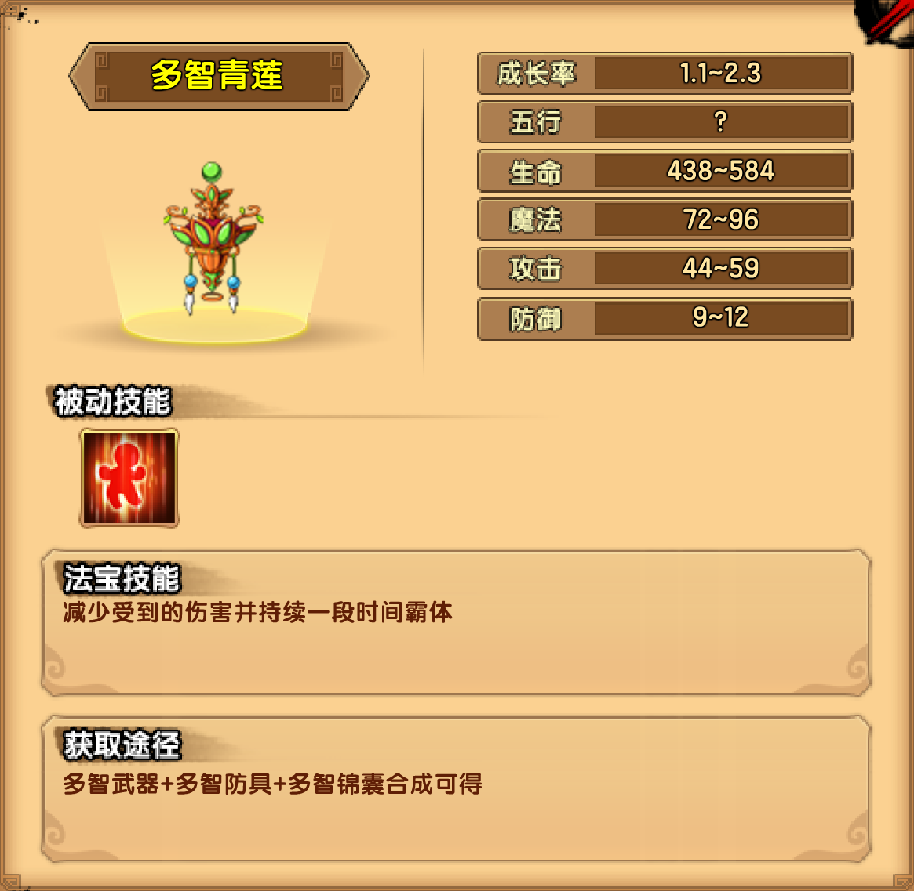

# 土

## 五台山口

### 金光孔雀

| 技能                                                         |
| ------------------------------------------------------------ |
| 金光天翔：全身覆盖一层金光，向目标玩家的方向冲去。           |
| 万千飞羽：展开双翅，射出数道羽刺射向目标玩家。               |
| 金雀开屏：展开尾羽，发出全屏金光，玩家会受到伤害并被致盲并黑屏 |

掉落装备：多智防具

## 锦绣峰

### 芙蓉仙子

| 技能                                                         |
| ------------------------------------------------------------ |
| 蔓藤乱舞：双臂化为蔓藤连续鞭打前方的玩家，造成多段伤害       |
| 汲血之缚：双臂化为蔓藤刺入地面，刺出后缠绕玩家，束缚数秒，并汲取生命 |
| 天女散花：召唤数个有毒的花瓣缓慢飘落，碰触到的玩家会受到持续伤害，持续伤害可叠加 |
| 夺命飞花：BOSS濒死时，自动恢复1%的生命并强化防御2秒，之后在上空召唤数个花瓣，快速射向玩家 |

掉落装备：多智武器

## 万佛朝阁

### 土之祖巫

| 技能                                                        |
| ----------------------------------------------------------- |
| 石像守卫：召唤2个邪恶的石像守卫攻击玩家                     |
| 沙之旋风：召唤能够来回移动的小型沙之旋风                    |
| 尖刺土墙：召唤2个尖刺土墙，土墙会缓缓向玩家移动，并射出土刺 |
| 泥土之缚：从地面伸出泥土状的手束缚玩家的行动。              |

掉落装备：多智锦囊

## 法宝

### 多智青莲

| 被动 | 属性 |
| ---- | ---- |
| 回血 | 1~2  |