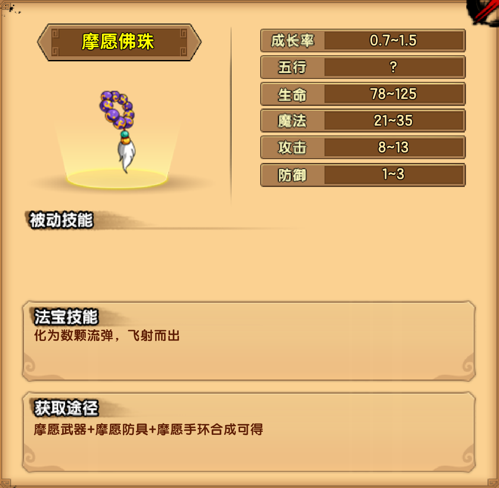

# 木

## 九华山麓

### 闵老护法

| 技能                                                         |
| ------------------------------------------------------------ |
| 藤甲护体：藤甲护体，霸体并提高防御，可反弹一定伤害           |
| 荡尽诸邪：扬起棍棒保护周身，并发出一道无形之气，中此招者将被定身1.5秒，之后被击飞 |
| 生死一击：集中全力往前水平捅出一棍，并发出一道无形之气，数秒后发作 |

掉落装备：摩愿防具

## 双溪寺

### 道明妖僧

| 技能                                                         |
| ------------------------------------------------------------ |
| 附体妖灵：召唤一个妖灵，缓缓向前飘去，碰触到玩家后会操纵玩家向BOSS所在的方向移动 |
| 致命妖爪：伸直手臂，直刺玩家的心脏，造成巨大的血魔伤害       |

掉落装备：摩愿武器

## 神光金岭

### 木之祖巫

| 技能                                                         |
| ------------------------------------------------------------ |
| 左翅千羽：左翅一展，射出8-10根锋利的羽毛，能将玩家打下木桩   |
| 右翅千羽：右翅一展，射出8-10根锋利的羽毛，能将玩家打下木桩   |
| 木桩阵：从地上指定坐标升起一个木桩，升起的过程中玩家碰触到会被击飞 |
| 毒封万里：唤醒地面的毒花毒草，释放剧毒覆盖整个地面           |

掉落装备：摩愿手环

## 法宝

### 摩愿佛珠

