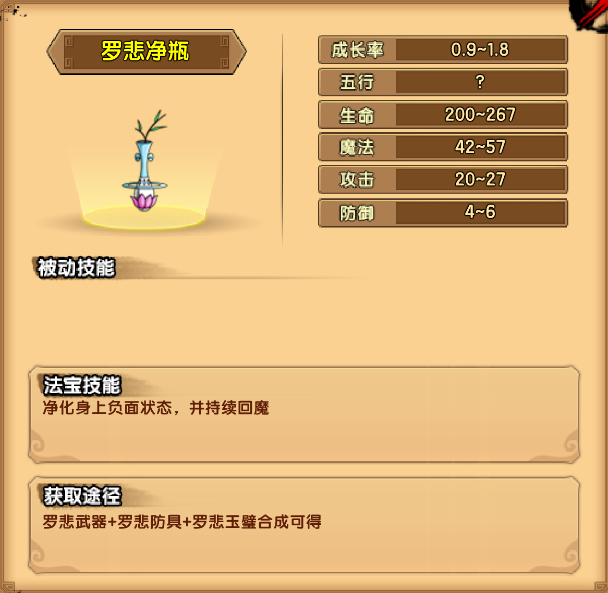

# 水

## 普陀山脚

### 灵感大王

| 技能                                                     |
| -------------------------------------------------------- |
| 重锤挥舞：挥舞双锤，攻击前方近身的玩家                   |
| 重锤漩涡：平举双锤，在水面上快速旋转                     |
| 重锤水弹：依次向玩家丢出两把锤子，锤子砸到水面，激起浪花 |
| 鱼跃：向多个坐标点中的任意一个跳跃                       |

掉落装备：罗悲防具

## 九龙宝殿

### 四头虫

| 技能                                                         |
| ------------------------------------------------------------ |
| 长戟挥舞：挥舞长戟，攻击前方近身的玩家                       |
| 血红刺杀：手持长戟向前突进                                   |
| 深海毒虫：背后有3个头，需要从背面攻击才能造成伤害，每累计一定的伤害背上的头会掉落1个，该头会落地成为独立的怪物 |
| 九头交替：当BOSS濒死且背后存在头时，可以消耗一个头使生命值恢复到最大值 |

掉落装备：罗悲武器

## 法华灵洞

### 水之祖巫

| 技能                                                         |
| ------------------------------------------------------------ |
| 长臂挥舞：缓慢挥舞下方两臂，攻击下方近身的玩家               |
| 连环水弹：右手一展，发出2-3个跟踪水弹                        |
| 漩涡水柱：贯穿水面的水柱，能够打破冰层。出现水柱前水面会有漩涡状的预警 |

掉落装备：罗悲玉璧

## 法宝

### 罗悲净瓶

