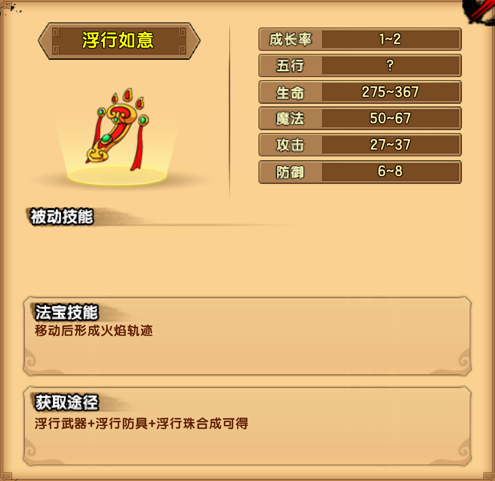

# 火

## 峨眉山道

### 赤炎金刚

| 技能                                                         |
| ------------------------------------------------------------ |
| 烈焰铁拳：积蓄力量后，往前挥出一击超重拳                     |
| 破山怒炎：高高跃起，跳向玩家所在位置，往下猛击，打破地面喷发出岩浆 |
| 连环重拳：缓慢前移并连续挥出重拳                             |

掉落装备：浮行防具

## 清音阁

### 噬火毒蝎

| 技能                                                         |
| ------------------------------------------------------------ |
| 火红毒钳：挥舞带火的双钳攻击前方近身的玩家，并附带灼烧效果   |
| 掘地火石：快速转入地面，往玩家所在的位置移动并伴随火柱冲出，造成伤害 |
| 蝎尾毒针：尾巴前伸，刺向玩家，造成伤害并附带剧毒             |

掉落装备：浮行武器

## 金顶云海

### 火之祖巫

| 技能                                                   |
| ------------------------------------------------------ |
| 长臂挥舞：缓慢挥舞下方两臂，攻击下方近身的玩家         |
| 不灭之火：召唤不灭之火，落地后会来回移动，持续较长时间 |
| 天外之火：上方的双手一抬，从空中召唤2-3个带火的陨石    |

掉落装备：浮行珠

## 法宝

### 浮行如意

