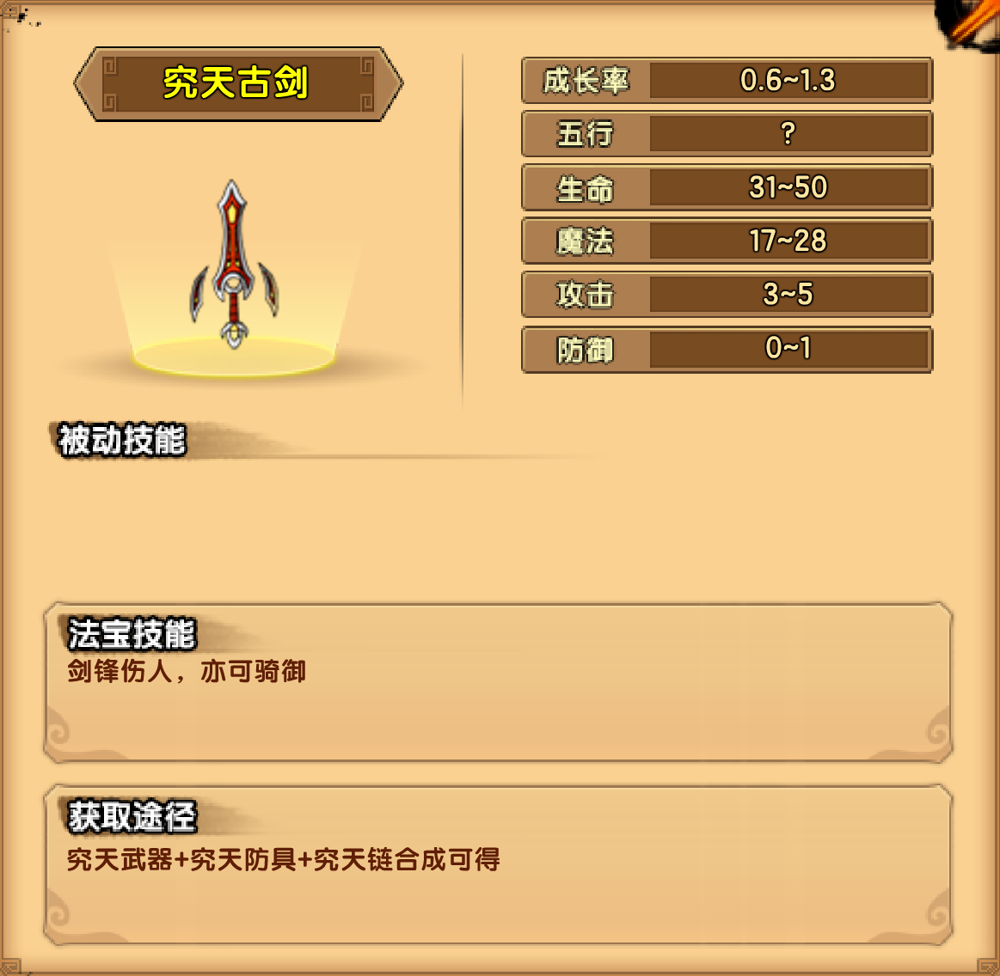

# 金

## 小怪掉落

| 白装武器 | 白装防具 |
| -------- | -------- |

## 玄武门

### 寅将军

| 技能                                                         |
| ------------------------------------------------------------ |
| 虎爪掏心：用双爪进行攻击，对前方范围内的玩家造成伤害         |
| 猛虎下山：往前上方跃起后，对下方的敌人进行猛扑,并在落地后再次造成冲击伤害 |
| 虎啸山林：发出巨大的怒吼，对周围的玩家造成多段伤害并击飞     |

掉落装备：究天防具

## 朱雀街

### 特处士

| 技能                                                       |
| ---------------------------------------------------------- |
| 蛮力凿击：挥舞狼牙棒进行攻击，对范围内的玩家造成伤害       |
| 蛮牛冲撞：向前方冲撞，对碰撞到的玩家造成多段伤害           |
| 地动山摇：猛踩地面，发出一道巨大的震波，晕眩站在地面的玩家 |

掉落装备：究天武器

## 未央宫

### 金之祖巫

| 技能                                                         |
| ------------------------------------------------------------ |
| 金龙吐息： 锁定玩家所在的方向，发射出一个光球，光球碰触地面后会反弹 |
| 回旋巨斧：在低空处缓慢地来回移动，玩家被碰触到后会受到伤害   |

掉落装备：究天链

## 法宝

### 究天古剑

