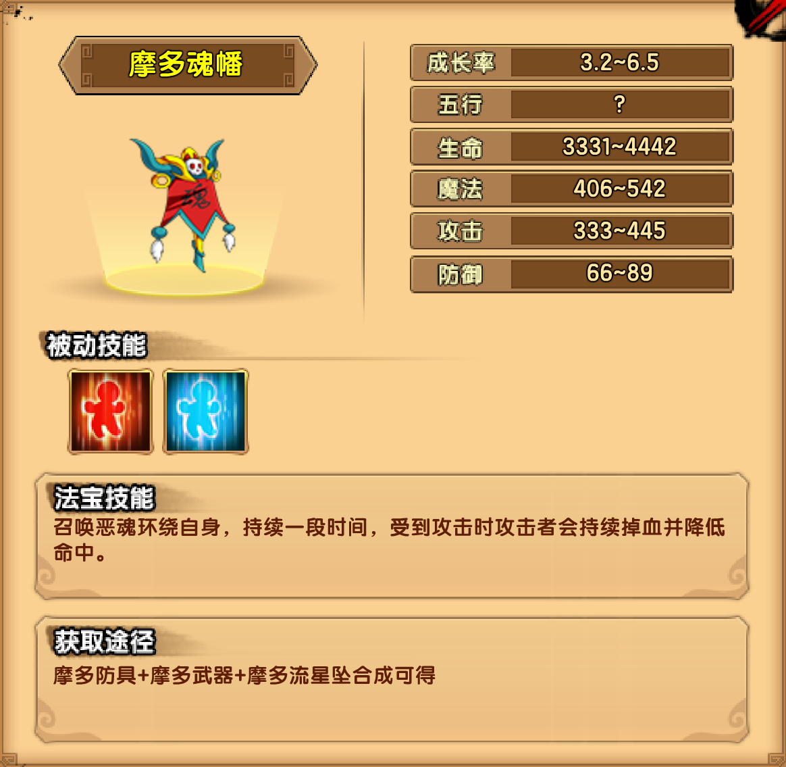

# 摩多

## 小怪掉落

| 木类材料 | 矿类材料 | 布类材料 |
| -------- | -------- | -------- |
| 青藤刺   | 海蓝晶   | 火浣纱   |

## 七叶树窟

| 婆雅稚技能                                                 |
| ---------------------------------------------------------- |
| 灾厄爆炎：旋转头部连续吐出3颗大火球                        |
| 爆裂重劈：后仰举棒，然后向前重劈                           |
| 夺魂飞刃：向前连续投掷旋转飞刃，被飞刃击中后将被夺取魔法值 |
| 一分为三：将身体分为三个继续战斗                           |

| 法身技能                           |
| ---------------------------------- |
| 灾厄爆炎：鼓足气，吐出一颗巨大火球 |
| 瞬间转移：瞬间转移到较远位置       |

| 报身技能                                                     |
| ------------------------------------------------------------ |
| 爆裂重劈：后仰举棒，然后向前重劈                             |
| 炼狱螺旋：在双棒上凝聚能量，之后向前跃起落下时将棒刺入地面，延地发出冲击波，造成巨额伤害 |

| 应身技能                                                     |
| ------------------------------------------------------------ |
| 夺魂飞刃：向前连续投掷旋转飞刃，被飞刃击中后将被夺取魔法值   |
| 沉默之刃：召唤沉默之刃绕自身旋转一段时间，若受到攻击则反伤攻击者，并使其沉默 |

掉落装备：摩多防具制作书

## 寒暑水

| 毗摩智多罗技能                                               |
| ------------------------------------------------------------ |
| 魔轮绞杀：头上长出短刺，缓慢旋转，撞向玩家，此时若攻击会被反伤 |
| 火叱冰息：每个头吐出一个火弹或冰弹，射向玩家所在位置（火弹有灼烧效果，冰弹有冰冻效果） |
| 恶业收割：左右来回挥动手臂横扫整个屏幕                       |
| 凶神践踏：召唤巨大的脚随机从空中踩下，共8次，每次踩一脚      |
| 凶神践踏：召唤巨大的脚从两边往中间在空中踩下，共3次          |
| 凶神践踏：召唤巨大的脚从左边往右边在空中踩下，共8次          |
| 凶神践踏：召唤巨大的脚从右边往左边在空中踩下，共8次          |
| 凶神践踏：召唤巨大的脚交叉间隔从空中踩下，共2次              |

掉落装备：摩多武器制作书（包括第二心法）

## 幕山

| 罗喉技能                                                     |
| ------------------------------------------------------------ |
| 极恶之光1：左侧眼睛位置发射极恶之光射向左侧                  |
| 极恶之光2：右侧眼睛位置发射极恶之光射向右侧                  |
| 极恶之光3：中间2只眼睛位置发射2道极恶之光射向两侧            |
| 死亡吐息1：左边的嘴巴突出死亡的烟雾，玩家在雾中会获得debuff（生命魔法持续减少），烟雾持续5秒 |
| 死亡吐息2：中边的嘴巴突出死亡的烟雾，玩家在雾中会获得debuff（生命魔法持续减少），烟雾持续5秒 |
| 死亡吐息3：右边的嘴巴突出死亡的烟雾，玩家在雾中会获得debuff（生命魔法持续减少），烟雾持续5秒 |
| 死亡技：召唤罗喉元神                                         |

| 罗喉元神技能                                                 |
| ------------------------------------------------------------ |
| 狂暴连打：挥动数只手臂向前连续攻击数拳                       |
| 绝命刺拳：举拳向前冲刺                                       |
| 覆障之球：向前投掷2颗黑暗之球，黑暗之球在往前飞行一段距离后会停止不动，持续一段时间，被命中后的玩家将失去视觉命中大幅下降 |
| 邪神之眼：在空中召唤1个邪神之眼                              |
| 天降神罚：背后张开法阵，向玩家所在位置连续发射4道激光        |
| 恶魂缠绕：弯腰并用手臂护住头部，同时周身缠绕恶魂，此时受到攻击，攻击者会获得debuff（持续掉血并降低命中，会叠加） |

掉落装备：摩多流星坠制作书

## 法宝

| 被动 | 属性  |
| ---- | ----- |
| 回血 | 11~15 |
| 回魔 | 7~10  |