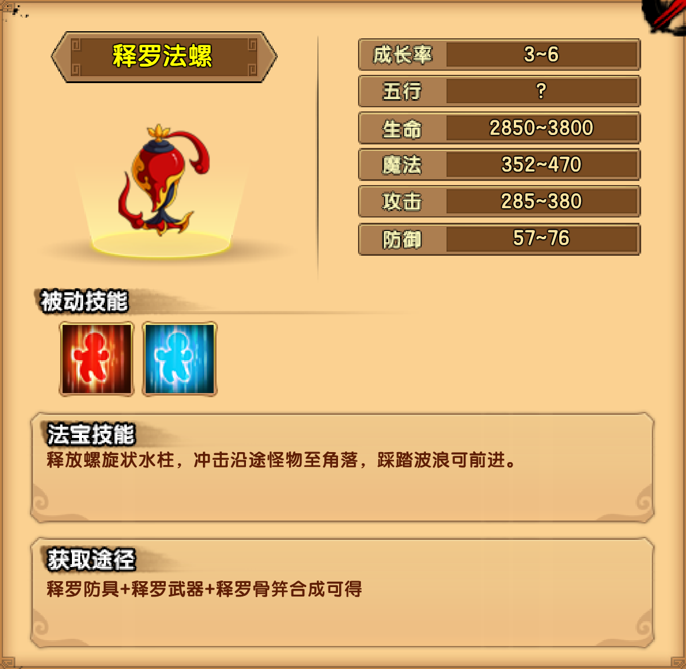

# 释罗

## 小怪掉落

| 木类材料 | 矿类材料 | 布类材料 |
| -------- | -------- | -------- |
| 菩提子   | 鲛人泪   | 天竺棉   |

## 凌云渡

| 那伽王技能                                                   |
| ------------------------------------------------------------ |
| 巨浪滔天：挥动手臂，打出一道巨浪                             |
| 剧毒水泡：跳入水中，张开多个头的嘴巴向玩家位置连续喷吐剧毒水泡 |
| 激流喷发：高高跃起，落向玩家位置，重击地面，喷发水流将击飞   |
| 潮汐之灵：召唤一个小水球，不断抽取水之力，缓缓变成一个大水球 |
| 啸海洪流：让水球沉入水中，发出咆哮，利用水之力爆发数道水柱   |
| 腐蚀毒液：在皮肤表面分泌腐蚀毒液，若在此时攻击BOSS会被叠加中毒状态；毒性较低，但可叠加多层 |

掉落装备：释罗防具制作书

## 蓝毗尼园

| 摩呼罗迦王-人形技能                                          |
| ------------------------------------------------------------ |
| 沉睡吹箭：猛吹笛子，向玩家所在方向射吹箭，被吹箭射中的玩家会进入睡眠状态，被攻击后会醒来，在睡眠状态下受到伤害加倍（睡醒有1秒延迟） |
| 万蛇之笼：在场上召唤一个蛇笼，可被破坏                       |
| 唤蛇之笛：吹响笛子，从全场的蛇笼中各召唤一只蛇               |
| 蟒神降临：化身为大蟒神，人身而蛇头                           |

| 摩呼罗迦王-蛇形技能                                          |
| ------------------------------------------------------------ |
| 沉睡之咬：双手化作蛇头伸长咬向玩家方向，被咬中的玩家会进入睡眠状态 |
| 万蛇之笼：在场上随机位置召唤二个蛇笼，可被破坏               |
| 唤蛇之鸣：朝天鸣叫，从全场的蛇笼中各召唤一只蛇               |
| 巨蟒之咬：张开血盆巨口，向前扑咬，夺取生命                   |
| 蟒蛇甩尾：甩动尾巴将玩家击飞                                 |

掉落装备：释罗武器制作书（包括第二心法）

## 菩提道场

| 罗骞驮技能                                                   |
| ------------------------------------------------------------ |
| 普通攻击：挥动四臂，向前下方猛击                             |
| 普通攻击：回旋四臂，对周围的玩家造成伤害                     |
| 暗流涌动：弯腰伸掌入水，搅动暗流，使水中的玩家受到持续伤害   |
| 巨浪滔天：下蹲，振起巨浪，沿着水面前进                       |
| 雷震四方：从手心张开大口，发出四个雷音球，短暂停留后爆炸，发出小范围音波，晕眩数秒 |
| 啸吼如雷：愤怒大吼，发出大范围音波，只要呆在空气中就会受到伤害，晕眩数秒 |
| 雷音护体：使体表皮肤高速震动一段时间，若受到攻击则反震攻击者，晕眩数秒 |

掉落装备：释罗骨笄制作书

## 法宝

| 被动 | 属性 |
| ---- | ---- |
| 回血 | 9~13 |
| 回魔 | 6~8  |